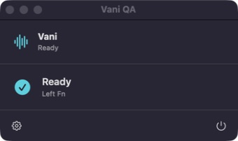

<p align="center">
  
</p>

# Vani

Private, native voice typing for Apple Silicon Macs.

Hold a shortcut, speak English, and release. Vani transcribes on your Mac and
inserts the result into the app you were using. There is no account, telemetry,
cloud transcription, or generative rewriting.

<p align="center">
  
</p>

## Status

Vani is a functional development beta for macOS 14 or newer on Apple Silicon. The
core workflow, recovery paths, native UI, deterministic audio fixture, and 500-cycle
reliability harness are implemented. Public releases remain blocked on Developer ID
credentials and notarization.

## What Works

- Hold Left Fn to dictate by default; Right Option and Right Command are available
- One-time English Parakeet TDT v2 model download
- Exact model-revision manifest with per-file SHA-256 verification
- Local microphone capture and Core ML transcription
- Process-bound paste delivery with app-scoped Accessibility verification
- Native Accessibility refusal for password and secure text fields
- Clipboard-preserving recovery when focus, insertion, or the clipboard changes
- Memory-only Last Transcript controls with Control-Command-V paste and
  Control-Command-C copy shortcuts
- Voice-triggered snippets with multiline expansions
- Opt-in local Smart Formatting for conservative fillers, spoken punctuation,
  sentence casing, and line breaks
- Optional bounded history, disabled by default
- Personal phrase dictionary and launch-at-login setting
- Metadata-only diagnostics with no transcript or audio content
- Public-repository Swift CodeQL analysis and weekly dependency updates

## Run Locally

Requirements: Apple Silicon, macOS 14+, Swift 6, 3 GB of free disk space, and about
1 GB of free memory for the warm speech model. Install Apple's command-line developer
tools first if `xcode-select -p` fails:

```bash
xcode-select --install
```

Then clone, check the Mac, and install:

```bash
git clone https://github.com/mrinoybanerjee/vani.git
cd vani
./scripts/doctor.sh
./scripts/install-local.sh
```

The first source build can take several minutes. After Vani opens in the menu bar:

1. Allow Microphone, Accessibility, and Input Monitoring when Vani requests them.
2. Download the verified 443 MiB English model once. It is the only required network
   download after the source dependencies are resolved.
3. In System Settings > Keyboard, set "Press Globe key to" to "Do Nothing."
4. Hold Left Fn, speak, then release to insert text.

Snippets and Smart Formatting are available in Settings. Smart Formatting is off by
default; enabling it recognizes `comma`, `period` or `full stop`, `question mark`,
`exclamation mark` or `exclamation point`, `colon`, `semicolon`, `new line`, and
`new paragraph`. It removes only standalone `um`, `uh`, and `erm` fillers and leaves
links, email addresses, and snippet expansions unchanged. Spoken command words are
necessarily interpreted as commands while the setting is on; turn it off when you need
those words literally.

If a permission does not update, quit and reopen the exact `/Applications/Vani.app`
bundle after granting it. See [Troubleshooting](docs/TROUBLESHOOTING.md) for focused
recovery steps.

The installer uses a stable `Vani Local Development` signing identity when one exists;
otherwise it uses an ad-hoc signature. Ad-hoc builds work, but macOS can request
permissions again after each rebuild. Contributors should follow
[Stable local signing](docs/BUILDING.md#stable-local-signing).

## Engineering

Vani is a small Swift 6 modular monolith. The real-time audio callback writes into a
preallocated bounded buffer; model work, text cleanup, insertion, storage, and UI
remain outside that callback. Dependencies are exact-pinned in `Package.resolved`.

- [Architecture](docs/ARCHITECTURE.md)
- [Project provenance](docs/PROVENANCE.md)
- [Privacy contract](PRIVACY.md)
- [Security model](docs/SECURITY_MODEL.md)
- [Benchmarks](docs/BENCHMARKS.md)
- [Building and local signing](docs/BUILDING.md)
- [Troubleshooting](docs/TROUBLESHOOTING.md)
- [Uninstalling](docs/UNINSTALLING.md)
- [Contributing](CONTRIBUTING.md)

## License

Apache-2.0. The downloaded speech model is CC BY 4.0. See
[third-party notices](THIRD_PARTY_NOTICES.md).
